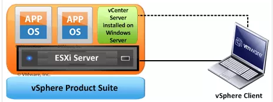

## Intro

### vSphere
- It is a package that contains multiple components, including vCenter, ESXi, vSphere client. 

### ESXi
- It is the virtualization server. 
- It is type 1 hypervisor. All the virtual machines or Guest OS are installed on ESXi server.

### vSphere client
- Allows administrators to connect to ESXi servers and access or manage virtual machines
- The vSphere client is used from client machine to connect to ESXi server and do management tasks

### vCenter
- vCenter server is similar to vSphere client but it’s a server with more power
- vCenter server is installed on Windows Server or Linux Server. 
- VMware vCenter server is a centralized management application that lets you manage virtual machines and ESXi hosts centrally
- vSphere client is used to access vCenter Server and ultimately manage ESXi servers.
- vCenter server is compulsory for enterprises to have enterprise features like vMotion, VMware High Availability, VMware Update Manager and VMware Distributed Resource Scheduler (DRS)

### Reference
- [Difference between vSphere, ESXi and vCenter](http://www.mustbegeek.com/difference-between-vsphere-esxi-and-vcenter/)
